<!-- README.md is generated from README.Rmd. Please edit that file -->

# tickle 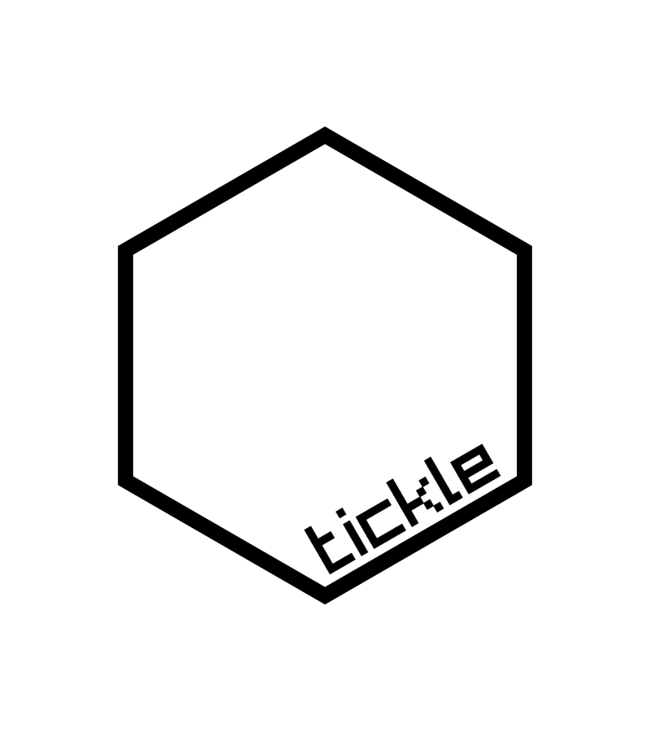

<!-- badges: start -->


[](https://github.com/coolbutuseless/tickle/actions)
<!-- badges: end -->

`{tickle}` is a package for creating UIs in base R.

This is an **opinionated abstraction** over the base R package
`{tcltk}`.

This package aims to provide:

-   a **simplified** UI creation process similar to `shiny`.
-   a **modern-looking** visual default.
-   **more documentation** to help create common UI elements without
    resorting to the online tcl/tk documentation.
-   a way to still access the low-level tcl/tk structures in order to
    achieve complex effects and customisation.

## What’s in the box

-   An array of `tic_*()` functions for nested creation of a UI
    specification.
-   `render_ui()` to render a UI specification into a window onscreen.
-   `reactive_*()` to create reactive values used to transfer values
    between the UI and R
-   `canvas_*()` functions to do some simple drawing an manipulation on
    canvas widgets.

## Overview

-   Create reactive variables (with `reactive_*()`) in order to pass
    values between R and the UI. e.g. the value of the slider, or the
    text in a text entry box.
-   Define callback functions that are called, say, when a button is
    pressed.
-   Create a UI specification by nesting containers and widgets with
    `tic_*()` calls. This specification can include
    -   binding callback functions to particular events like mouse
        buttons or key presses (`bind` argument)
    -   controlling how widgets are packed within their parent container
        (`pack` argument)
-   Render the UI to an actual object on the screen with `render_ui()`
-   The object returned by `render_ui()` can be ignored by beginners.
    For intermediate/advanced users, this object is a nested list of
    `tclObj` objects representing the UI components, and these can be
    further manipulated with `{tcltk}` to finesse and configure the UI.

## Installation

You can install from [GitHub](https://github.com/coolbutuseless/tickle)
with:

``` r
# install.package('remotes')
remotes::install_github('coolbutuseless/tickle')
```

## Hello World

Things to note:

-   Define a reactive variable for the slider before defining the UI
-   UI specificaiton created with nested `tic_*()` calls.
-   Some commands (e.g. `tic_button()`) have an explicit command
    function which is run when they are activated.
-   After defining the UI specificaiton, it is rendered to screen with
    `render_ui()`

``` r
library(tickle)

value <- reactive_dbl(40)

ui_spec <- tic_window(
  title = "Hello World", 
  tic_row(
    tic_col(
      tic_button("Hello", command = function() {message("Hello")}, style = 'primary'),
      tic_button("World", command = function() {message("World")})
    ),
    tic_col(
      tic_slider(value),
      tic_label(textvariable = value)
    )
  )
)

win <- render_ui(ui_spec)
```

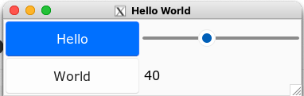

## Gallery

<a href="https://coolbutuseless.github.io/package/tickle/articles/detailed-example.html">
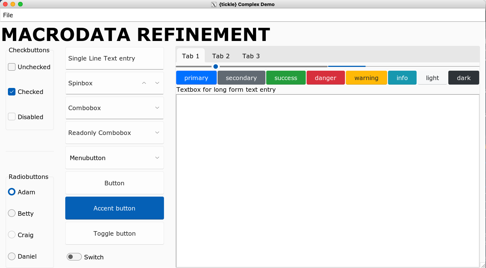 </a>
<hr />
<br />
<a href="https://coolbutuseless.github.io/package/tickle/articles/juliaset.html">
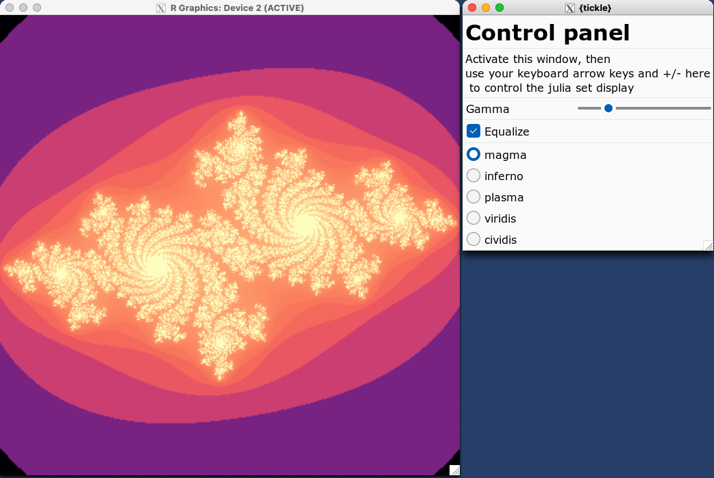 </a>
<hr />

<br />
<a href="https://coolbutuseless.github.io/package/tickle/articles/ggreview.html">
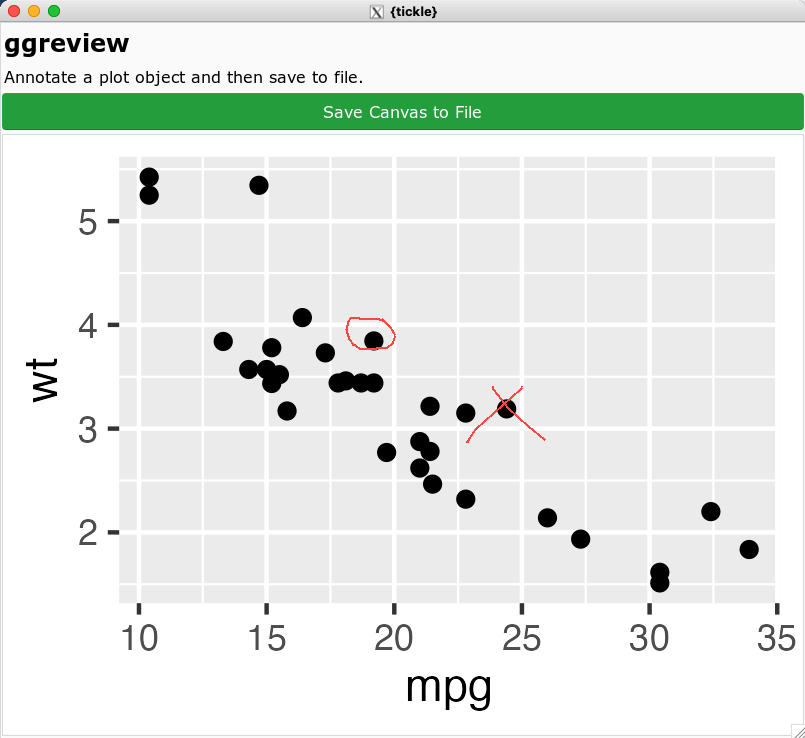 </a>

## Examples/Vignettes

Please view the online vignettes for more details on how to use
`{tickle}`

-   [Big example with lots of
    widgets](https://coolbutuseless.github.io/package/tickle/articles/detailed-example.html)
-   [Reactive
    Values](https://coolbutuseless.github.io/package/tickle/articles/reactive.html)
-   [Annotate ggplots (using mouse
    events)](https://coolbutuseless.github.io/package/tickle/articles/ggreview.html)
-   [Pop-up
    Windows](https://coolbutuseless.github.io/package/tickle/articles/popups.html)
-   [Overview of all Widgets &
    Containers](https://coolbutuseless.github.io/package/tickle/articles/widgets.html)
-   [JuliaSet explorer (using keyboard events and rendering to a grid
    window)](https://coolbutuseless.github.io/package/tickle/articles/juliaset.html)
-   [Changing
    font](https://coolbutuseless.github.io/package/tickle/articles/fonts.html)
-   [Understanding widget
    layout](https://coolbutuseless.github.io/package/tickle/articles/packing.html)

## Containers

Containers are ways of grouping multiple widgets.

Containers can be nested within other containers to achieve complex
layouts.

| Container                                                               | Code/Description                                                                                            |
|-------------------------------------------------------------------------|-------------------------------------------------------------------------------------------------------------|
| 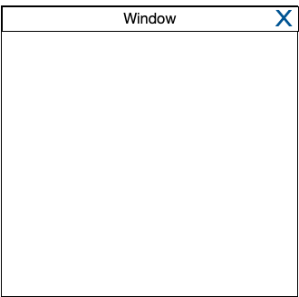      | <code>tic_window(…)</code><br /> Create a top level window                                                  |
| 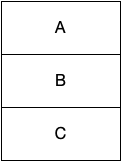         | <code>tic_col(A, B, C)</code><br /> Layout objects in column                                                |
| 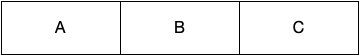         | <code>tic_row(A, B, C)</code><br /> Layout objects rowwise                                                  |
| 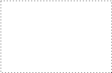       | <code>tic_frame(…)</code><br /> Invisible container. Useful for advanced users who want to customize layout |
| 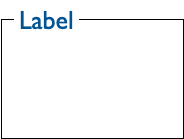  | <code>tic_labelframe(…)</code><br /> Frame with a a label and usually visible outline                       |
| 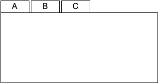    | <code>tic_notebook(A, B, C)</code><br /> Tabbed display                                                     |
| 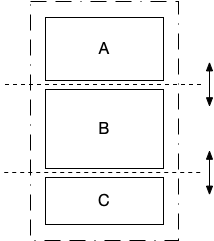 | <code>tic_panedwindow(A, B, C)</code><br /> Layout multiple elements which can be resized as panes          |

## Widgets

| Widget                                                                       | Code/Description                                                                                                                                             |
|------------------------------------------------------------------------------|--------------------------------------------------------------------------------------------------------------------------------------------------------------|
| 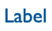               | <code>tic_label(…)</code><br /> Display text. If you need headings rather than body text, Use `style = 'h1'` to `style = 'h5'` for different sized text      |
| 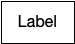              | <code>tic_button(…)</code><br /> Clickable button. Available `style` options: ‘primary’, ‘seconary’, ‘info’, ‘success’, ‘warning’, ‘danger’, ‘light’, ‘dark’ |
| 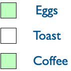 | <code>tic_checkbutton(…)</code><br /> On/off button (default styling)                                                                                        |
| 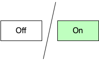  | <code>tic_checkbutton(…)</code><br /> On/off button with `style = 'toggle'`                                                                                  |
| 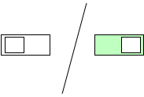  | <code>tic_checkbutton(…)</code><br /> On/off button with `style = 'switch'`                                                                                  |
| 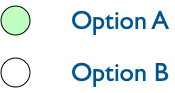         | <code>tic_radiobutton(…)</code><br /> Groups of mutually exclusion options                                                                                   |
| 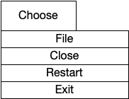          | <code>tic_menubutton(…)</code><br /> Button which displays a drop-down menu                                                                                  |
| 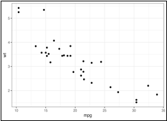              | <code>tic_canvas(…)</code><br /> General drawing canvas                                                                                                      |
| 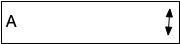             | <code>tic_spinbox(…)</code><br /> Choose options                                                                                                             |
| 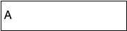            | <code>tic_combobox(…)</code><br /> Choose options                                                                                                            |
| 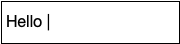           | <code>tic_textentry(…)</code><br /> Single line text entry                                                                                                   |
| 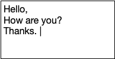             | <code>tic_textbox(…)</code><br /> Multipe line text entry                                                                                                    |
| 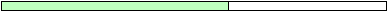         | <code>tic_progressbar(…)</code><br /> Progress bar                                                                                                           |
| 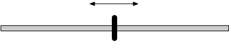              | <code>tic_slider(…)</code><br /> Slider                                                                                                                      |

## Popups

*Popups* are windows which are initiated separate from the main UI.

| Popup                                                                | Code/Description                        |
|----------------------------------------------------------------------|-----------------------------------------|
| 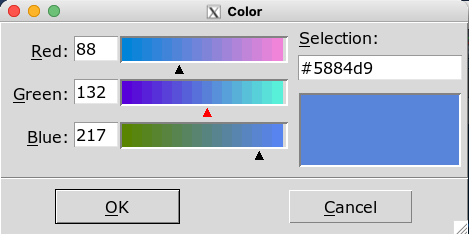 | <code>popup_color_picker()</code><br /> |
| 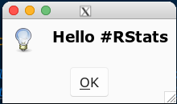   | <code>popup_messagebox()</code><br />   |
| 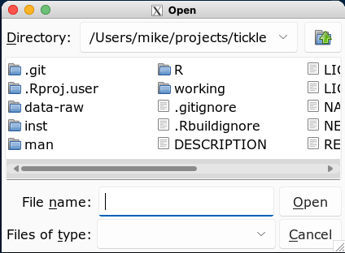    | <code>popup_open_file()</code><br />    |
|     | <code>popup_save_file()</code><br />    |

## Canvas

After creating a canvas with `tic_canvas()`, it can be manipulated with
the following commands:

-   Draw on the canvas
    -   `canvas_line()`
    -   `canvas_text()`
    -   `canvas_rect()`
    -   `canvas_polygon()`
    -   `canvas_oval()`
    -   `canvas_arc()`
-   `canvas_plot()` render a plot to the canvas
-   `canvas_clear()` clear all objects from the canvas
-   `canvas_image()` render an image from a file to the canvas
-   `canvas_save()` save the contents of the canvas to an image file.

The actual canvas in tcl/tk renders *structured graphics* and it is much
more like SVG or PDF than just a simple array of pixels.

The canvas implementation in this package treats the canvas as just a
raster object i.e. a rectangular collection of pixels. This made it
easier to write this package and keep the API/syntax simple, but it
doesn’t unleash the full power of the canvas.

The effort to write a more complete abstraction over the canvas is not
currently warranted. **Please get in contact if such a facility is
important to you.**

# Theme

The theme for this package is an adaptaton of the `sun-valley-light`
theme available [from rdbende on
github](https://github.com/rdbende/Sun-Valley-ttk-theme).

The `sun-valley-light` theme is MIT licensed (see “LICENSE-sun-valley”)
and has been adapted into the theme `r-sun-valley-light` included in
this package which has the following extra features:

-   Styles ‘h1’ through ‘h5’ for different sized heading text to use
    with `tic_label()` widgets.
    -   To use: `tic_label(..., style = 'h1')`
-   Standard buttons colours from
    [Bootstrap](https://getbootstrap.com/docs/4.0/components/buttons/)
    to use with `tic_button()` widgets.
    -   To use: `tic_button(..., style = 'primary')`
    -   Available styles: primary, secondary, success, danger, warning,
        info, light, dark

## Possible Future Features

The following items are not yet implemented, or incomplete:

-   Popup menus when a user right-clicks in the window.
-   No access yet to the “grid” geometry layout.
-   treeview, listbox and some other widgets

## Package Name

-   `tcl` is the scripting language
-   `tk` is the graphics toolkit for `tcl`
-   `tcl/tk` is often how the langauge and toolkit are talked about as a
    single entity
-   `{tcltk}` is the R package interfacing to `tcl/tk`
-   `tcl` is often pronounced as “tickle” i.e. `tcl/tk` =
    “tickle-tee-kay”

## Acknowledgements

-   R Core for developing and maintaining the language.
-   CRAN maintainers, for patiently shepherding packages onto CRAN and
    maintaining the repository
