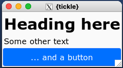
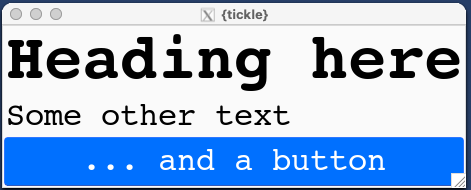

```{r, include = FALSE}
knitr::opts_chunk$set(
  collapse = TRUE,
  comment = "#>"
)
```


## Fonts

`{tickle}` includes some commands for manipulating the font.


## Listing all fonts on your system

```{r eval = FALSE}
library(tickle)
head(list_font_families(), 50)
```


## Simple app

```{r eval = FALSE}
ui_spec <- tic_window(
  tic_col(
    tic_label("Heading here", style = 'h2'),
    tic_label("Some other text"),
    tic_button("... and a button", style = 'primary')
  )
)

win <- render_ui(ui_spec)
```




## Adjust the fonts

Changing the font will have an immediate effect on the current UI.

```{r eval = FALSE}
set_font_family(body = 'Courier', headings = 'Luxi Sans')
set_font_scale(2)
```





