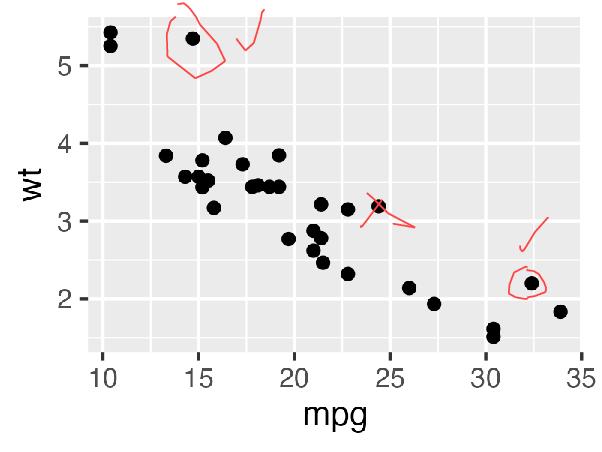

```{r, include = FALSE}
knitr::opts_chunk$set(
  collapse = TRUE,
  comment = "#>"
)
```

## Description

This is a moderately complex example where the user can draw on a rendered plot
and then save this plot to a named file.

Code features:

* pop-ups
* button command
* binding events on the canvas to functions


# Video 

Since an interactive window cannot be captured in a vignette, a video
screen capture has been taken of the window and included below.

<video controls>
  <source src="video/ggreview.mp4" type="video/mp4">
  Your browser does not support the video tag.
</video> 


# Final image


The final saved image:




# Code

```{r eval=FALSE}
library(ggplot2) 
library(tickle)

#~~~~~~~~~~~~~~~~~~~~~~~~~~~~~~~~~~~~~~~~~~~~~~~~~~~~~~~~~~~~~~~~~~~~~~~~~~~~~
# At the time of definining the button action, need to define a variable
# which will later contain the actual canvas
#~~~~~~~~~~~~~~~~~~~~~~~~~~~~~~~~~~~~~~~~~~~~~~~~~~~~~~~~~~~~~~~~~~~~~~~~~~~~~
canvas <- NULL

#~~~~~~~~~~~~~~~~~~~~~~~~~~~~~~~~~~~~~~~~~~~~~~~~~~~~~~~~~~~~~~~~~~~~~~~~~~~~~
# When the button is pressed:
#   - request name of file to save from the user
#   - save the canvas
#~~~~~~~~~~~~~~~~~~~~~~~~~~~~~~~~~~~~~~~~~~~~~~~~~~~~~~~~~~~~~~~~~~~~~~~~~~~~~
save_action <- function() {
  filename <- popup_save_file()
  if (length(filename) == 0) { return() }
  canvas_save(
    canvas   = canvas,
    filename = filename
  )
  message("Saved canvas to: ", filename)
}

#~~~~~~~~~~~~~~~~~~~~~~~~~~~~~~~~~~~~~~~~~~~~~~~~~~~~~~~~~~~~~~~~~~~~~~~~~~~~~
# set some global variables for the events
#~~~~~~~~~~~~~~~~~~~~~~~~~~~~~~~~~~~~~~~~~~~~~~~~~~~~~~~~~~~~~~~~~~~~~~~~~~~~~
drawing <- FALSE
lastx <- NA
lasty <- NA

#~~~~~~~~~~~~~~~~~~~~~~~~~~~~~~~~~~~~~~~~~~~~~~~~~~~~~~~~~~~~~~~~~~~~~~~~~~~~~
# If a button is pressed, start drawing
#~~~~~~~~~~~~~~~~~~~~~~~~~~~~~~~~~~~~~~~~~~~~~~~~~~~~~~~~~~~~~~~~~~~~~~~~~~~~~
mouse_press_action <- function(x, y) {
  drawing <<- TRUE
  lastx   <<- x
  lasty   <<- y
}

#~~~~~~~~~~~~~~~~~~~~~~~~~~~~~~~~~~~~~~~~~~~~~~~~~~~~~~~~~~~~~~~~~~~~~~~~~~~~~
# When the button is released, stop drawing
#~~~~~~~~~~~~~~~~~~~~~~~~~~~~~~~~~~~~~~~~~~~~~~~~~~~~~~~~~~~~~~~~~~~~~~~~~~~~~
mouse_release_action <- function() {
  drawing <<- FALSE
}

#~~~~~~~~~~~~~~~~~~~~~~~~~~~~~~~~~~~~~~~~~~~~~~~~~~~~~~~~~~~~~~~~~~~~~~~~~~~~~
# If the mouse is moving, and the 'drawing' mode is TRUE, 
# then draw a line segment from the last position to the current mouse position
#~~~~~~~~~~~~~~~~~~~~~~~~~~~~~~~~~~~~~~~~~~~~~~~~~~~~~~~~~~~~~~~~~~~~~~~~~~~~~
mouse_move_action <- function(x, y) {
  if (drawing) {
    canvas_line(canvas, c(lastx, x), c(lasty, y), fill = '#ff4444', width = 2)
    lastx <<- x
    lasty <<- y
  }
}

#~~~~~~~~~~~~~~~~~~~~~~~~~~~~~~~~~~~~~~~~~~~~~~~~~~~~~~~~~~~~~~~~~~~~~~~~~~~~~
# Simple UI spec
#~~~~~~~~~~~~~~~~~~~~~~~~~~~~~~~~~~~~~~~~~~~~~~~~~~~~~~~~~~~~~~~~~~~~~~~~~~~~~
ui_spec <- tic_window(
  tic_col(
    pack_def = pack_opts(pady = 2),
    tic_label("ggreview", style = 'h3'),
    tic_label("Annotate a plot object and then save to file."),
    tic_button("Save Canvas to File", style = "success", command = save_action),
    tic_canvas(
      width = 800, height = 600, scrollbars = FALSE, 
      bind = list(
        bind_opts("Button"       , mouse_press_action),
        bind_opts("ButtonRelease", mouse_release_action),
        bind_opts("Motion"       , mouse_move_action)
      ))
  )
)

#~~~~~~~~~~~~~~~~~~~~~~~~~~~~~~~~~~~~~~~~~~~~~~~~~~~~~~~~~~~~~~~~~~~~~~~~~~~~~
# Render the UI to screen
#~~~~~~~~~~~~~~~~~~~~~~~~~~~~~~~~~~~~~~~~~~~~~~~~~~~~~~~~~~~~~~~~~~~~~~~~~~~~~
win <- render_ui(ui_spec)
canvas <- win$col$canvas_frame$canvas

#~~~~~~~~~~~~~~~~~~~~~~~~~~~~~~~~~~~~~~~~~~~~~~~~~~~~~~~~~~~~~~~~~~~~~~~~~~~~~
# Render a plot to the canvas
#~~~~~~~~~~~~~~~~~~~~~~~~~~~~~~~~~~~~~~~~~~~~~~~~~~~~~~~~~~~~~~~~~~~~~~~~~~~~~
p <- ggplot(mtcars) + geom_point(aes(mpg, wt))
canvas_plot(canvas, plot = p, width = 800, height = 600)
```

