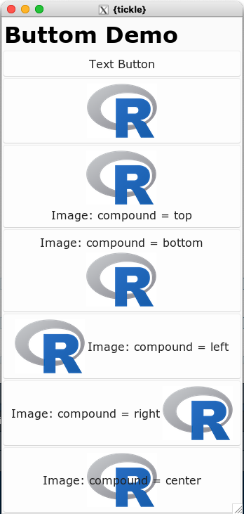

```{r, include = FALSE}
knitr::opts_chunk$set(
  collapse = TRUE,
  comment = "#>"
)
```

# Images in buttons

It is possible to include images in buttons - either with or without text.

The image is specified as a pathname to a file with the `image` argument.

The relative layout of the text and the image is controlled by the `compound` argument.

```{r eval=FALSE}
library(tickle)

ui_spec <- tic_window(
  tic_col(
    tic_label("Buttom Demo", style = 'h2'),
    tic_button("Text Button"),
    tic_button("Image", image = "image/Rlogo.png"),
    tic_button("Image: compound = top"   , image = "image/Rlogo.png", compound = 'top'),
    tic_button("Image: compound = bottom", image = "image/Rlogo.png", compound = 'bottom'),
    tic_button("Image: compound = left"  , image = "image/Rlogo.png", compound = 'left'),
    tic_button("Image: compound = right" , image = "image/Rlogo.png", compound = 'right'),
    tic_button("Image: compound = center", image = "image/Rlogo.png", compound = 'center')
  )
)


win <- render_ui(ui_spec)
```



