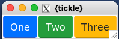
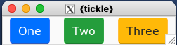
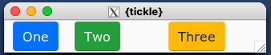

```{r, include = FALSE}
knitr::opts_chunk$set(
  collapse = TRUE,
  comment = "#>"
)
```

## Widget Layout

In `{tickle}` widgets are positioned within their parent container using the
"pack" geometry manager.

Every widget has a `pack` argument to define how it should be placed within 
its parent container.

Since container elements can be nested, every container (e.g. `tic_row()`) 
also has a `pack` argument.

In addition, container elements also include a `pack_def` argument 
which defines the default packing arguments for all its immediate children.

For simple layouts, you almost never need to explicitly set the `pack` or
`pack_def` options i.e. careful use of `tic_row()` and 
`tic_col()` will do 95% of what you need.

Understanding pack options will become more useful as your layout and 
design become more complicated.   This vignette doesn't go into details, 
and the interested user is encouraged to refer to [the original tcl/tk pack documentation](https://www.tcl.tk/man/tcl8.6/TkCmd/pack.html)

## `pack_opts()`

The best way to construct the values passed to `pack` and `pack_def` is to
create them with a call to `pack_opts()`.

Using `pack_opts()` assists by making use of auto-complete and also sanity 
checking the values that are passed in.


## Default

```{r eval = FALSE}
ui_spec <- tic_window(
  tic_row(
    tic_button("One"  , style = 'primary'),
    tic_button('Two'  , style = 'success'),
    tic_button('Three', style = 'warning')
  )
)

win <- render_ui(ui_spec)
```




## Set `pack_def` on container (`tic_row()`)

```{r eval = FALSE}
ui_spec <- tic_window(
  tic_row(
    pack_def = pack_opts(padx = 10),
    tic_button("One"  , style = 'primary'),
    tic_button('Two'  , style = 'success'),
    tic_button('Three', style = 'warning')
  )
)

win <- render_ui(ui_spec)
```




## Set `pack` on individual widgets

```{r eval = FALSE}
ui_spec <- tic_window(
  tic_row(
    tic_button("One"  , style = 'primary', pack = pack_opts(padx = 10)),
    tic_button('Two'  , style = 'success', pack = pack_opts(padx = 10)),
    tic_button('Three', style = 'warning', pack = pack_opts(padx = 10))
  )
)

win <- render_ui(ui_spec)
```


## Set `pack_def` on parent container and use  `pack` on individual widgets to override

```{r eval = FALSE}
ui_spec <- tic_window(
  tic_row(
    pack_def = pack_opts(padx = 10),
    tic_button("One"  , style = 'primary'),
    tic_button('Two'  , style = 'success'),
    tic_button('Three', style = 'warning', pack = pack_opts(padx = 50))
  )
)

win <- render_ui(ui_spec)
```





