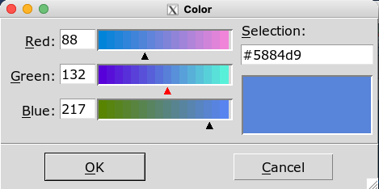
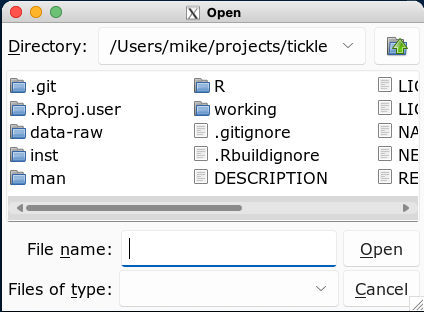
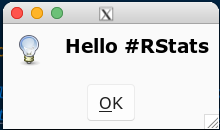
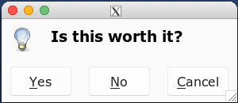

```{r, include = FALSE}
knitr::opts_chunk$set(
  collapse = TRUE,
  comment = "#>"
)
```

# Popup Windows

Pop-up windows work independently of any other UI elements. That is, you 
can use these popups without having initialised or rendered any other UI elements.

* `popup_color_picker()` for choosing a colour
* `popup_open_file()`/`popup_save_file()` for choosing files
* `popup_messagebox()` for showing a message in a window.


## Color Picker

After selecting a colour and clicking "OK" the hexcode for that colour 
is returned to the user

```{r eval=FALSE}
library(tickle)
popup_color_picker()
```




## Open/Save File

These popups will let you choose a file to open or save.

The 'save' popup has extra checks like asking you if you'd like to overwrite
an existing file.

```{r eval=FALSE}
library(tickle)
popup_open_file()
popup_save_file()
```



<br/>


## Message box

This popup displays a popup and can be configured to show different sets of buttons
e.g. "ok/cancel", "Yes/no/cancel" etc.


```{r eval=FALSE}
library(tickle)
popup_messagebox("Hello #RStats")
popup_messagebox("Is this worth it?", type = 'yesnocancel')
```



<br/>


