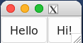
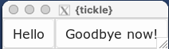

```{r, include = FALSE}
knitr::opts_chunk$set(
  collapse = TRUE,
  comment = "#>"
)
```


## Passing values with reactive variables

**Reactive values** are a means of passing data from R to the UI and vice versa.

* `reactive_chr()`, `reactive_lgl()`, `reactive_int()` and `reactive_dbl()` will 
  create a reactive variable of the given type.
* `reactive_textbox()` is a special variable needed to handle the current 
  contents of a multiline textbox.
  
If you are familiar with `shiny`, then reactive values in this package work 
in a similar way to `shiny::reactiveVal` objects.

  
```{r}
library(tickle)

val <- reactive_dbl(1.0)

# To fetch the actual value, call with no argument
val()

# Give an argument to set the value
val(1.23)
val()
```


```{r eval = FALSE}
button_text <- reactive_chr("Hi!")
ui_spec <- tic_window(
  tic_button(text = "Hello"), # Plain old boring string
  tic_button(textvariable = button_text) # reactive value
)

win <- render_ui(ui_spec)
```



```{r eval = FALSE}
# Now change the reactive variable, and the button text changes
button_text("Goodbye now!")
```


