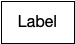
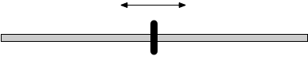
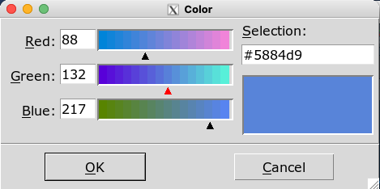

```{r, include = FALSE}
knitr::opts_chunk$set(
  collapse = TRUE,
  comment = "#>"
)
```


## Containers

Containers are ways of grouping multiple widgets.

Containers can be nested within other containers to achieve complex layouts.

| Container  | Code/Description   |
|---|---|
|   | <code>tic_window(...)</code><br /> Create a top level window  |
|    | <code>tic_col(A, B, C)</code><br />  Layout objects in column |
|    | <code>tic_row(A, B, C)</code><br /> Layout objects rowwise|
|    | <code>tic_frame(...)</code><br /> Invisible container. Useful for advanced users who want to customize layout |
|    |  <code>tic_labelframe(...)</code><br /> Frame with a a label and usually visible outline  |
|    | <code>tic_notebook(A, B, C)</code><br />  Tabbed display |
|    | <code>tic_panedwindow(A, B, C)</code><br /> Layout multiple elements which can be resized as panes|


## Widgets

| Widget  | Code/Description  |
|---|---|
|    | <code>tic_label(...)</code><br />  Display text. If you need headings rather than body text, Use `style = 'h1'` to `style = 'h5'` for different sized text |
|    | <code>tic_button(...)</code><br /> Clickable button. Available `style` options: 'primary', 'seconary', 'info', 'success', 'warning', 'danger', 'light', 'dark' |
|    | <code>tic_checkbutton(...)</code><br />  On/off button (default styling) |
|    | <code>tic_checkbutton(...)</code><br />  On/off button with `style = 'toggle'` |
|    | <code>tic_checkbutton(...)</code><br />  On/off button with `style = 'switch'` |
|    | <code>tic_radiobutton(...)</code><br />  Groups of mutually exclusion options|
|    | <code>tic_menubutton(...)</code><br />  Button which displays a drop-down menu |
|    | <code>tic_canvas(...)</code><br /> General drawing canvas |
|    | <code>tic_spinbox(...)</code><br /> Choose options |
|    | <code>tic_combobox(...)</code><br />  Choose options |
|    | <code>tic_textentry(...)</code><br /> Single line text entry  |
|    | <code>tic_textbox(...)</code><br />  Multipe line text entry  |
|    | <code>tic_progressbar(...)</code><br /> Progress bar  |
|    | <code>tic_slider(...)</code><br />  Slider |


## Popups

*Popups* are windows which are initiated separate from the main UI.

| Popup  | Code/Description |
|---|---|
|   | <code>popup_color_picker()</code><br />   |
|   | <code>popup_messagebox()</code><br />   |
|   | <code>popup_open_file()</code><br />   |
|   | <code>popup_save_file()</code><br />   |


## Canvas


After creating a canvas with `tic_canvas()`, it can be manipulated with the following
commands:

* Draw on the canvas
    * `canvas_line()`
    * `canvas_text()`
    * `canvas_rect()`
    * `canvas_polygon()`
    * `canvas_oval()`
    * `canvas_arc()`
* `canvas_plot()` render a plot to the canvas
* `canvas_clear()` clear all objects from the canvas
* `canvas_image()` render an image from a file to the canvas
* `canvas_save()` save the contents of the canvas to an image file.


The actual canvas in tcl/tk renders *structured graphics* and it is much more like
SVG or PDF than just a simple array of pixels.

The canvas implementation in this package treats the canvas as just a raster 
object i.e. a rectangular collection of pixels.  This made it easier to write
this package and keep the API/syntax simple, but it doesn't unleash the full
power of the canvas.

The effort to write a more complete abstraction over the canvas is
not currently warranted.  **Please get in contact if such a facility is important to you.**


